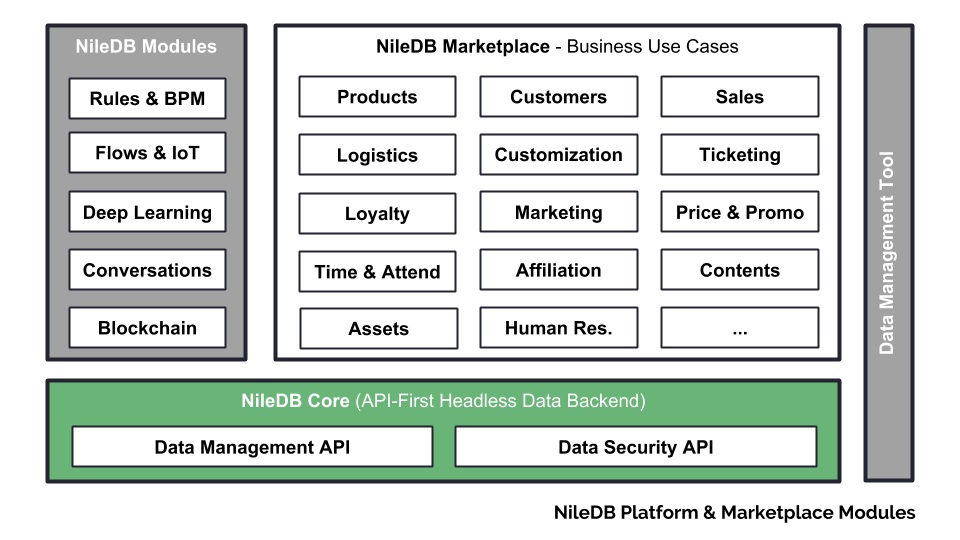

# NileDB Core

[NileDB](https://niledb.com) is an Open Enterprise Data Backend.

### Documentation

For details how to use `NileDB Core` please look at the documentation: 

There is also a tutorial here: 

Please take a look at our [releases](https://github.com/niledb/core/releases) if you want to learn more about new releases and the changelog.

### Code of Conduct

Please note that this project is released with a [Contributor Code of Conduct](CODE_OF_CONDUCT.md).
By contributing to this project (commenting or opening PR/Issues etc) you are agreeing to follow this conduct, so please
take the time to read it. 

### Acknowledgments

This product uses and is based on the following:
* [Vert.x](http://vertx.io/)
* [graphql-java](http://graphql-java.readthedocs.io/)
* [PostgreSQL](https://www.postgresql.org/)
* [Timescale](http://www.timescale.com/)
* [GraphiQL](https://github.com/graphql/graphiql/)
* [GraphQL Playground](https://github.com/graphcool/graphql-playground/)
* [HikariCP](https://brettwooldridge.github.io/HikariCP/)
* [Apache Commons](https://commons.apache.org/)
* [OpenJDK](http://openjdk.java.net/)
* [Docker](https://www.docker.com/)

### License

NileDB Core is licensed under the GNU General Public License v3.0. See [LICENSE](LICENSE.md) for details.

Copyright (c) 2018, NileDB, Inc.

[NileDB Core License](LICENSE.md)
