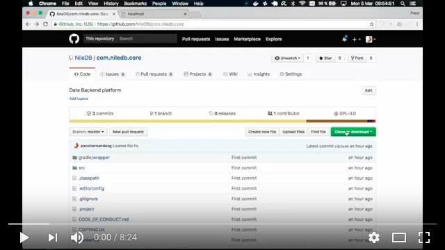

# NileDB Core

Welcome to [NileDB](https://niledb.com) Core, an open-source Data Backend written in Java and based on PostgreSQL & GraphQL.

NileDB Core dynamically generates a GraphQL API on top of your PostgreSQL database to let you integrate your front-end apps with your data in an easy, quick, secure, and scalable way.

### Quick Start

You can start experimenting quickly with this basic tutorial.

In order to make it easier to start, we have recorded the tutorial in the following video:

You need [Java](https://www.java.com/en/download/) & [Docker](https://www.docker.com/get-docker) installed previously in order to successfully complete this tutorial.

First of all, you need to download the project:

    > git clone https://github.com/NileDB/com.niledb.core.git
    > cd com.niledb.core

Now, you can build the project:

    > ./gradlew build

Once we have built the project, you can deploy two docker containers, one for the database, and the other for the GraphQL API:

    > docker-compose up
    
First time, an empty database will be created. Then, you can open another terminal window and connect to the database:

    > docker exec -it db psql -U postgres niledb

And, create some tables:

    niledb=# create table product (id serial primary key, name text, description text);

You have created a "product" table. Now, you can test GraphQL API. Open a browser in http://localhost and type:

    mutation {
      __reloadSchema
    }

In order to execute GraphQL commands you must click on the play button.

Once GraphQL schema is automatically generated, you can refresh the browser.

Now, you can create some products:

    mutation {
      productCreate (
        entity: {
          name: "Portable Picnic Table"
          description: "Portable folding picnic table with seating for four."
        }
      ) {
        id
        name
        description
      }
    }
    
You can also query your database with different criteria, full-text search, ...:

    query {
      productList(where: {
        description: {SEARCH: {query: "tables & seats"}}
      }) {
        id
        name
        description
      }
    }

Let's create a "category" table and a relation to the "product" table (in your SQL console):

    niledb=# create table category (id serial primary key, name text);
    niledb=# alter table product add column category int;
    niledb=# alter table add constraint category foreign key (category) references category(id);
    
Now, refresh the GraphQL schema:

    mutation {
      __reloadSchema
    }

Once GraphQL schema is automatically generated, you can refresh the browser.

Let's insert a category:

    mutation {
      categoryCreate(entity: {
        name: "Outdoor recreation"
      }) {
        id
        name
      }
    }

Let's modify our products to be in the new category:

    mutation {
      productUpdate(entity: {
          category: 1
        }
        where: {
          id: {EQ: 1}
        }
      ) {
        id
        name
        description
        category
      }
    }

Now, let's query the relation between "product" and "category" in both directions:

    query {
      categoryList {
        id
        name
        products: productListViaCategory {
          id
          name
          description
        }
      }
    }
    
    query {
      productList {
        id
        name
        description
        categoryViaCategory {
          id
          name
        }
      }
    }

Feel free to explore the other features (i.e. Sorting results, pagination [limit & offset], different filtering operators, ...).

Finally, you can delete data also:

    mutation {
      productDelete(
        where: {
          id: {EQ: 1}
        }
      ) {
        id
        name
      }
    }

In this short tutorial, we have explored the following NileDB Core features:

* Dynamically generating & evolving GraphQL API.
* Performing CRUD operations (Create, Read, Update, Delete).
* Querying relations (JOINs) bi-directionally.
* Full-text search capabilities.

Feel free to give us your feedback in order to improve the available features. Thanks.

### Build

In order to build NileDB Core, you need [Java](https://www.java.com/en/download/) to be installed previously.

First of all, you need to download the project:

    > git clone https://github.com/NileDB/com.niledb.core.git
    > cd com.niledb.core

Now, you can build the project:

    > ./gradlew build

### Run

NileDB Core is packaged as a fat jar. In order to run, you need to execute the following command:

    > java -jar build/libs/com.niledb.core-0.8.2-fat.jar --conf config.json

Using the config.json file, you can configure the following properties:

* <b>"service.host"</b>: Address where server will listen for GraphQL API requests. Default value: "localhost".
* <b>"service.port"</b>: Port number where server will listen for GraphQL API requests. Default value: 8080.
* <b>"service.ssl"</b>: SSL enabled. Default value: false.
* <b>"service.ssl.autoGenerateCert"</b>: SSL auto generated certificates. Default value: false.
* <b>"service.ssl.key.path"</b>: SSL key path. Default value: "misc/ssl/private.pem".
* <b>"service.ssl.cert.path"</b>: SSL certificate path. Default value: "misc/ssl/public.pem".
* <b>"service.authenticate"</b>: Basic authentication enabled. Default value: false.
* <b>"service.username"</b>: Basic authentication username. Default value: "niledb".
* <b>"service.password"</b>: Basic authentication password. Default value: "1234".
* <b>"service.query.maxResults"</b>: Maximum number of results returned by a GraphQL query. Default value: 100.
* <b>"service.forceSsl"</b>: Force SSL use, redirecting from non-SSL url. Default value: false.
* <b>"service.redirectFromPort"</b>: Source port number from where the server will redirect. Default value: 8080.
* <b>"service.redirectUrl"</b>: Target URL where the server will redirect to. Default value: "https://localhost:8443".
* <b>"db.name"</b>: Database name. Default value: "pagila".
* <b>"db.schema.name"</b>: Schema name. Default value: "public".
* <b>"db.host"</b>: PostgreSQL server host address. Default value: "localhost".
* <b>"db.port"</b>: PostgreSQL server port number. Default value: 5432.
* <b>"db.replica.host"</b>: PostgreSQL read-only replica host address. Default value: "localhost".
* <b>"db.replica.port"</b>: PostgreSQL read-only replica port number. Default value: 5432.
* <b>"db.username"</b>: PostgreSQL username. Default value: "postgres".
* <b>"db.password"</b>: PostgreSQL password. Default value: "postgres".
* <b>"model.path"</b>: Not implemented yet. Default value: "model.xmi".
* <b>"model.createModelFromDb"</b>: Not implemented yet. Default value: true.
* <b>"model.createDbFromModel"</b>: Not implemented yet. Default value: true.

### Docker Compose package

If you don't have an available PostgreSQL server, you can run a docker-compose pre-packaged version also:

    > docker-compose up
    
This will start two containers, one with PostgreSQL server and the other with GraphQL server, and it will create an empty database "niledb".

You can connect to the database with the command:

    > docker exec -it db psql -U postgres niledb

Once you have finished adding tables, indexes, custom types, constraints, ..., you can refresh GraphQL schema. Open a browser in http://localhost and type:

    mutation {
      __reloadSchema
    }
    
Now, refresh your browser, and the API will be available.

### Code of Conduct

Please note that this project is released with a [Contributor Code of Conduct](CODE_OF_CONDUCT.md).
By contributing to this project (commenting or opening PR/Issues etc) you are agreeing to follow this conduct, so please
take the time to read it. 

### Acknowledgments

This product uses and is based on the following:
* [Vert.x](http://vertx.io/)
* [graphql-java](http://graphql-java.readthedocs.io/)
* [PostgreSQL](https://www.postgresql.org/)
* [Timescale](http://www.timescale.com/)
* [GraphiQL](https://github.com/graphql/graphiql/)
* [GraphQL Playground](https://github.com/graphcool/graphql-playground/)
* [HikariCP](https://brettwooldridge.github.io/HikariCP/)
* [Apache Commons](https://commons.apache.org/)
* [OpenJDK](http://openjdk.java.net/)
* [Docker](https://www.docker.com/)

### License

NileDB Core is licensed under the GNU General Public License v3.0. See [LICENSE](LICENSE.txt) for details.

Copyright (c) 2018, NileDB, Inc.

[NileDB Core License](LICENSE.txt)
